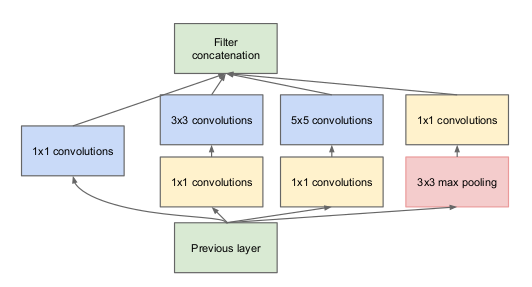
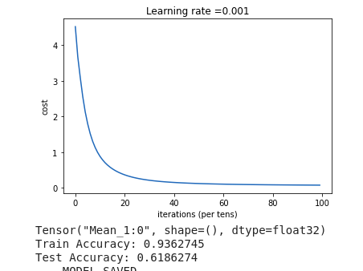

# CNN using Tensorflow

## Data Preprocessing

1. Oxford flower dataset has been used.

2. Images are first gone through the process of segmentation to identify main subjects in the image. (Segmented images are available with the dataset also)(refer the image below)

3. Resized images to 299X299.

4. Normalized those images to ensure similar data distribution.

5. Divided images in the train test split for further calculations.

## Model Structure

1. Pretrained model inception-v3 has been used for training the images. Its weights were originally obtained by training on the ILSVRC-2012-CLS dataset for image classification ("Imagenet").

2. The inception model goes with the basic concept of using different size filters at each stage and concatenate those results from the filters to get more efficient output.

3. One module of inception consist of (1X1 conv layer --> 5X5 conv layer) + (1X1 conv layer --> 3X3 conv layer) + (1X1 conv layer) + (maxpool layer --> 1X1 conv layer) (refer the image )

4. There are many such layers that are shown in the above images stacked upon each other. For more details, [check this out](https://www.analyticsvidhya.com/blog/2018/10/understanding-inception-network-from-scratch/).

5. Inception-v3 is the upgraded version of inception model which has optmized structure for better inferncing and consume less computational resources.To understand the structure of v3:[click](https://medium.com/@sh.tsang/review-inception-v3-1st-runner-up-image-classification-in-ilsvrc-2015-17915421f77c)

## Training and Inferencing
1. Training samples are further divided into batches of size 128.
 
2. Each batch goes through the network,error gets calculated for that respective batch and gradients are backpropagated.(Mini Batch Gradient Descent)

3. Cross-Entropy loss is used for calculating the error during the training process.

4. Model is tested on unseen examples which is the test spilt.

5. The accuracy obtained on the train set is 93% and the test set is 61%.

## Model Functions:

1. Batches function is used to create mini-batches of the data.

2. Create a placeholder function which is used to define the shape of inputs.

3. Forward Pass function calls the model from tensorhub.

4. Compute cost function is used for defining the cost function for the model.

5. Data is trained for 100 epochs with a learning rate of 0.001.

Credits: [Link](https://arxiv.org/pdf/1708.03763.pdf)  
Code Inspired from:[Link](https://github.com/Kulbear/deep-learning-coursera/blob/master/Convolutional%20Neural%20Networks/Convolution%20model%20-%20Application%20-%20v1.ipynb)  
Data and Code:https:[Link](//drive.google.com/drive/folders/1mS9Um9oQnkFRfVcmwx8Kdz_pfUGumU02?usp=sharing)